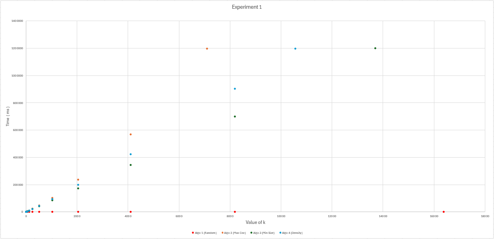
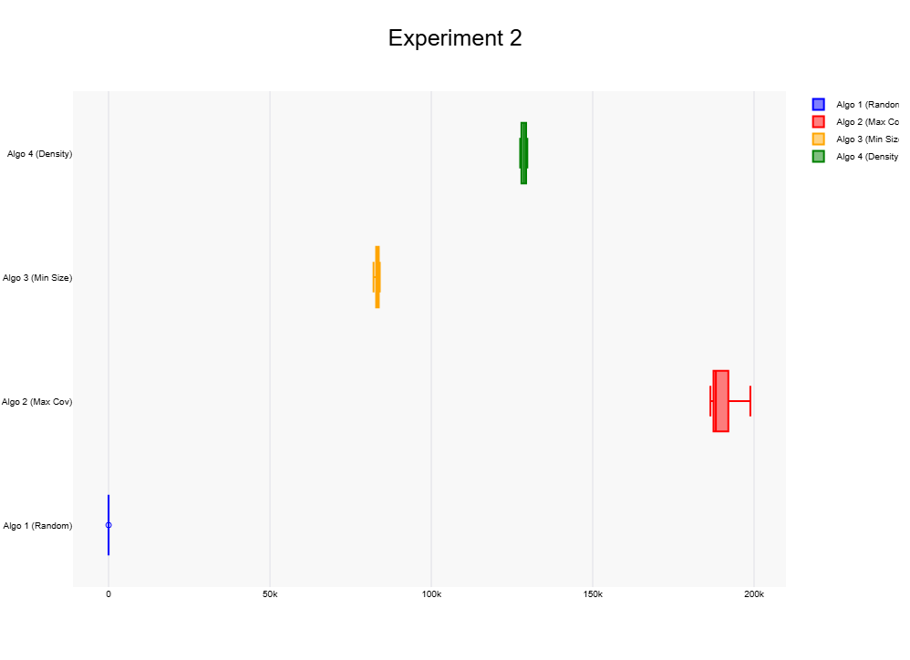
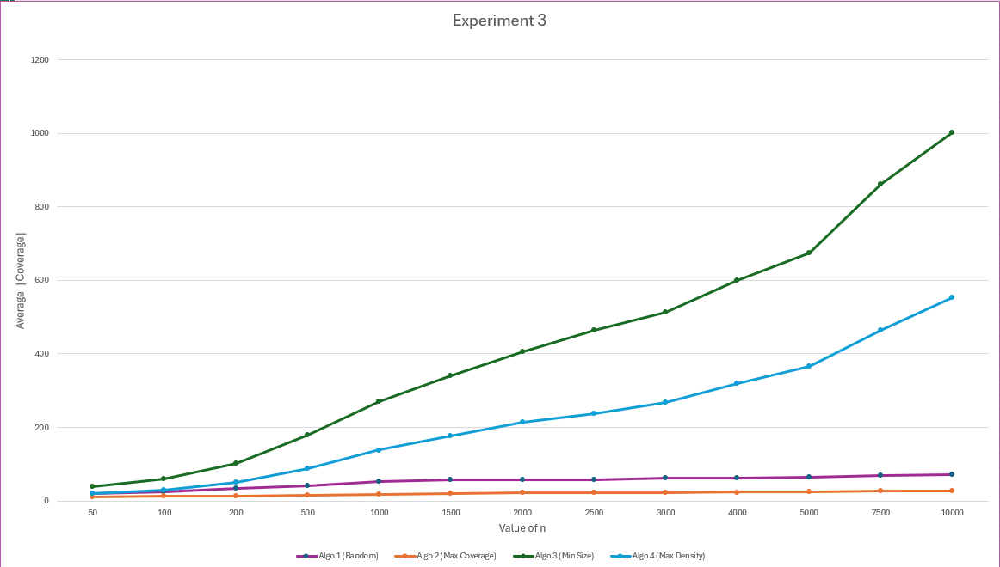

REPORT – ΕΠΛ236 Oμαδική Εργασία - Τeam 10
Κάλυψη Χώρου με Δρομολογητές

Πείραμα 1 – Έλεγχος Μέγιστου Μεγέθους Συνόλου Κάλυψης

Προϋποθέσεις για Δύσκολο Στιγμιότυπο (Απουσία Κάλυψης για Μικρά k)

Για να μην υπάρχει έγκυρο σύνολο κάλυψης μεγέθους k, το στιγμιότυπο εισόδου πρέπει να πληροί συγκεκριμένες προϋποθέσεις. Πρώτον, ο χώρος U πρέπει να είναι αρκετά μεγάλος (μεγάλο n), ώστε λίγα σύνολα να μην μπορούν να τον καλύψουν. Δεύτερον, τα σύνολα Sᵢ πρέπει να έχουν μικρό μέγεθος c σε σχέση με το n, έτσι ώστε κάθε σύνολο να καλύπτει μόνο ένα μικρό κλάσμα του U. Τρίτον, τα σύνολα πρέπει να έχουν ελάχιστη επικάλυψη μεταξύ τους, ώστε να μην υπάρχει "εύκολη" συγκέντρωση κάλυψης. Υπό αυτές τις συνθήκες, απαιτείται μεγάλος αριθμός συνόλων k για να επιτευχθεί πλήρης κάλυψη του U.

Παράμετροι Στιγμιότυπου που Χρησιμοποιήθηκε:

Παράμετρος        Τιμή
n                 1.000.000
m                 500.000
c                 10

Πειραματικά Δεδομένα (Μέσος χρόνος εκτέλεσης, σε ms)

k               Algo 1 (Random)        Algo 2 (Max Cov)      Algo 3 (Min Size)      Algo 4 (Density)
1               0.12                        55.73                 79.32                  77.90
2               0.09                       104.58                159.34                 161.50
4               0.08                       404.93                310.97                 324.40
8               0.08                       787.69                663.14                 664.69
16              0.09                     1.373.25              1.326.74               1.321.19
32              0.10                     2.747.63              2.754.40               2.700.93
64              0.14                     5.603.88              5.280.26               5.481.31
128             0.18                    11.415.36             10.738.07              11.060.52
256             0.28                    23.169.82             21.416.88              22.509.83
512             0.42                    48.103.51             43.005.83              45.999.86
1024            0.74                   103.664.46             86.233.12              95.395.97
2048            1.38                   235.864.48            172.401.67             199.539.84
4096            2.68                   568.430.10            345.864.38             423.271.88
8192            5.66                   — (>20 min)           699.864.82             904.089.09
16384           13.17                  —                     — (>20 min)            — (>20 min)
32768           26.77                  —                     —                      —
65536           55.08                  —                     —                      — 
131072          167.58                 —                     —                      —
262144          201.66                 —                     —                      —
500000          179.48                 —                     —                      —

Για τον εντοπισμό του ορίου των 20 λεπτών, χρησιμοποιήθηκε δυαδική αναζήτηση μεταξύ του τελευταίου έγκυρου και του πρώτου υπερβατικού k:

ΑλγόριθμοςΤελευταίο          Tελευταίο k εντός ορίου
Algo 1 (Random)               500.000 ( τελευταία τιμή που ελέγχθηκε )
Algo 2 (Max Cov)              7.104
Algo 3 (Min Size)             13.696
Algo 4 (Density)              10.559

Παρατηρήσεις και Συμπεράσματα

Τα αποτελέσματα του Πειράματος 1 επιβεβαίωσαν ως ένα βαθμό τις προβλέψεις μας, αλλά αποκάλυψαν και σημαντικές διαφορές που αξίζει να σχολιαστούν.
Ο Αλγόριθμος 1 (Random) ήταν κατά πολύ ο πιο γρήγορος, φτάνοντας έως k=500.000 χωρίς να ξεπεράσει το όριο των 20 λεπτών. Ο λόγος αυτής της γιγάντιας διαφοράς είναι το γεγονός ότι ενώ και οι τέσσερις αλγόριθμοι έχουν θεωρητική worst-case πολυπλοκότητα O(k·m·c), στην πράξη ο Random σπάνια χρειάζεται να δοκιμάσει πολλά σύνολα ανά βήμα ,όταν τα χρήσιμα σύνολα είναι u από τα m, χρειάζονται περίπου m/u δοκιμές, και για τυχαία στιγμιότυπα το u είναι μεγάλο, με αποτέλεσμα πραγματική πολυπλοκότητα κοντά στο O(k·c). Αυτό σημαίνει ότι είναι m φορές γρηγορότερος ανά επανάληψη από τους άπληστους αλγορίθμους. Στο στιγμιότυπό μας με m=500.000 και c=10, για k=10.000 επαναλήψεις ο Random εκτελεί περίπου 10^5 ελέγχους, ενώ ο Max Coverage εκτελεί 5·(10^10), διαφορά της τάξης των 500.000x. Επιπλέον, το μικρό c=10 υπάρχει η περίπτωση να ευνοεί ιδιαίτερα τον Random λόγω τοπικότητας των αναφορών, τα 10 στοιχεία ενός συνόλου χωράνε στην Cache της CPU, ενώ οι άπληστοι αλγόριθμοι σαρώνουν τεράστια τμήματα της RAM σε κάθε βήμα, προκαλώντας misses.
Αυτό που μας εξέπληξε ήταν η σειρά κατάταξης των άπληστων αλγορίθμων. Είχαμε προβλέψει ότι ο πιο αργός θα ήταν ο Algo 4 (Density) λόγω της επιπλέον πράξης διαίρεσης, με τους Algo 2 και Algo 3 να είναι παρόμοιοι μεταξύ τους. Στην πράξη όμως, ο πιο αργός αποδείχθηκε ο Algo 2 (Max Cov) με όριο k=7.104, ακολουθούμενος από τον Algo 4 (k=10.559) και τον Algo 3 (k=13.696). Πιστεύουμε ότι αυτή η διαφορά οφείλεται στο επιπλέον κόστος που έχει ο Algo 2, σε κάθε βήμα πρέπει να υπολογίσει πόσα νέα στοιχεία καλύπτει κάθε σύνολο σε σχέση με τα ήδη επιλεγμένα, κάτι που απαιτεί περισσότερες πράξεις από την απλή σύγκριση μεγέθους Sᵢ του Algo 3 ή τον υπολογισμό της πυκνότητας του Algo 4.
Συνολικά, η σειρά μεγίστου k ήταν Algo1 >> Algo3 > Algo4 > Algo2, ενώ είχαμε προβλέψει Algo1 > Algo2 = Algo3 > Algo4. Η πρόβλεψη για τον Algo 1 ως ταχύτερο επιβεβαιώθηκε, αλλά υποτιμήσαμε το πραγματικό κόστος του κριτηρίου επιλογής του Algo 2, και αντίστοιχα υπερεκτιμήσαμε την επίπτωση της επιπλέον διαίρεσης του Algo 4.

Γράφημα Χρόνου Εκτέλεσης vs k

Πείραμα 2 – Διασπορά Χρόνου Εκτέλεσης σε Σταθερό «Δύσκολο» Στιγμιότυπο

Για να μην εντοπίζεται άμεσα ένα έγκυρο Coverage μεγέθους k, το στιγμιότυπο εισόδου πρέπει να πληροί τις εξής προϋποθέσεις. Τα υποσύνολα πρέπει να έχουν μεγάλη επικάλυψη μεταξύ τους, ώστε κανένα να μην ξεχωρίζει ως προφανής επιλογή. Το k πρέπει να είναι οριακά επαρκές, δηλαδή το ελάχιστο δυνατό για να υπάρχει έγκυρη κάλυψη. Τέλος, τα μεγέθη Sᵢ και οι πυκνότητες των υποσυνόλων πρέπει να είναι παρόμοιες μεταξύ τους, έτσι ώστε οι αλγόριθμοι 2, 3 και 4 να μην μπορούν να ξεχωρίσουν εύκολα ποιο υποσύνολο να επιλέξουν.

Παράμετροι στιγμιότυπου που χρησιμοποιήθηκε:

Παράμετρος                Τιμή
n                         300000
m                         150000
c                         100
k                         5000

Πειραματικά Δεδομένα (10 εκτελέσεις ανά αλγόριθμο, σε ms)
Εκτέλεση      Algo 1 (Random)     Algo 2 (Max Cov)     Algo 3 (Min Size)   Algo4(Density) 
 1            5.06                190500.43            82902.84            128608.48
 2            4.21                192019.01            82093.92            129374.86
 3            3.48                198839.18            83025.47            127910.40
 4            4.04                194107.98            83625.99            128078.34
 5            3.64                188442.96            83707.90            129744.04
 6            3.46                187722.73            82954.44            127525.14
 7            3.46                187880.55            82149.02            128800.71
 8            3.71                187425.55            83751.90            129630.37
 9            3.97                186469.43            84025.14            127672.31
 10           3.52                187309.86            83719.77            129124.44
 

Στατιστικά Σύνοψης:
Στατιστικό    Algo 1              Algo 2               Algo 3              Algo 4
Μέσος (ms)    3.86                190071.77            83195.64            128646.91
Ελάχιστο      3.46                186469.43            82093.92            127525.14
Μέγιστο       5.06                198839.18            84025.14            129744.04

Γράφημα Διασποράς του Χρόνου Εκτέλεσης

Τα αποτελέσματα του Πειράματος 2 συμφωνούν ως ένα βαθμό με τις προβλέψεις μας. Ο Αλγόριθμος 1 (Random) ήταν όπως αναμέναμε ο πιο γρήγορος με μέσο χρόνο 3.86ms, κάτι λογικό αφού δεν κάνει καμία σύγκριση — απλά επιλέγει τυχαία.
Αυτό που μας εξέπληξε ήταν ότι ο πιο αργός δεν ήταν ο Algo 4 όπως είχαμε προβλέψει, αλλά ο Algo 2 (Max Cov) με μέσο χρόνο 190071.77ms. Πιστεύουμε ότι αυτό συμβαίνει γιατί ο Algo 2 πρέπει ,τελικά αφού τον υλοποιήσαμε, σε κάθε βήμα να ελέγξει όλα τα m υποσύνολα για να βρει αυτό με τη μέγιστη κάλυψη, κάτι που στην πράξη αποδείχθηκε πιο βαρύ από την επιπλέον διαίρεση που κάνει ο Algo 4. Ο Algo 3 (Min Size) ήταν λίγο πιο γρήγορος από τον Algo 4 (83195.64ms vs 123646.91ms), πράγμα που βγάζει νόημα αφού ο Algo 4 κάνει μια επιπλέον πράξη.
 Συνολικά η σειρά ταχύτητας βγήκε Algo1 >> Algo3 > Algo4 > Algo2, ενώ είχαμε προβλέψει Algo1 >> Algo2 = Algo3 > Algo4. Η κύρια διαφορά ήταν η θέση του Algo 2, τον οποίο υπερτιμήσαμε αρχικά στις προβλέψεις μας.

Πείραμα 3 – Ποιότητα Λύσης vs Μέγεθος Προβλήματος (n)

Παράχθηκαν τυχαία στιγμιότυπα με αυξανόμενο n, διατηρώντας σταθερές τις παραμέτρους:
Παράμετρος     Τιμή
m              2n
c              n/5
k              m = 2n

Για κάθε τιμή n, παράχθηκαν 5 τυχαία στιγμιότυπα και εκτελέστηκαν και οι 4 αλγόριθμοι. Καταγράφηκε ο μέσος όρος του |Coverage| για κάθε αλγόριθμο.

Πειραματικά Δεδομένα (Μέσος |Coverage|)
n          Algo 1 (Random)       Algo 2 (Max Cov)     Algo 3 (Min Size)    Algo 4 (Density) 50         21.00                 11.00                 38.40                20.80
100        24.20                 12.20                 60.00                29.00
200        34.20                 13.40                101.80                49.80
500        41.80                 16.20                177.80                86.80
1000       52.20                 18.60                270.60               138.00
1500       57.00                 20.40                339.40               176.20
2000       57.20                 21.20                406.60               213.20
2500       57.20                 21.60                464.60               238.00
3000       61.40                 22.60                513.20               268.20
4000       63.00                 23.40                599.20               319.80 
5000       64.00                 24.40                674.60               365.00
7500       69.60                 26.00                862.80               464.40
10000      70.40                 27.00               1003.20               552.60

Γράφημα Μέσου |Coverage| vs n

Τα αποτελέσματα του Πειράματος 3 ήταν αρκετά διαφορετικά από αυτό που περιμέναμε. Ο Αλγόριθμος 2 (Max Cov) βγήκε ξεκάθαρα ο καλύτερος, παράγοντας σταθερά τη μικρότερη κάλυψη σε όλες τις τιμές του n . Αν και δεν το είχαμε προβλέψει ως πρώτο, έχει νόημα , το να επιλέγεις κάθε φορά το σύνολο που καλύπτει τα περισσότερα νέα στοιχεία είναι ένας τρόπος σκέψης λύσης πολλών παρόμοιων προβλημάτων που είδαμε στο μάθημα.
Αυτό που μας εξέπληξε περισσότερο ήταν η απόδοση του Αλγορίθμου 1 (Random), ο οποίος βγήκε δεύτερος, ενώ τον είχαμε προβλέψει τελευταίο. Πιστεύουμε ότι αυτό οφείλεται στο ότι με k=m=2n ο αλγόριθμος έχει πολλές επιλογές και αρκετές ευκαιρίες για να καλύψει το U ακόμα και τυχαία. Αντίθετα, ο Αλγόριθμος 4 (Density), τον οποίο είχαμε προβλέψει πρώτο, κατέληξε τρίτος. Η πυκνότητα αποδείχθηκε στην πράξη λιγότερο αποτελεσματικό κριτήριο από όσο νομίζαμε, και φαίνεται πως δεν εξασφαλίζει ότι καλύπτονται νέα στοιχεία σε κάθε βήμα.
Ο Αλγόριθμος 3 (Min Size) ήταν σαφώς ο χειρότερος, φτάνοντας 1003.20 σύνολα για n=10000, με σχεδόν γραμμική αύξηση καθώς μεγαλώνει το n. Το να επιλέγει πάντα το μικρότερο σύνολο φαίνεται πως δεν σημαίνει ότι καλύπτει γρήγορα το U.Πολύ σημαντικό είναι επίσης το γεγονός ότι οι Algo 1 και Algo 2 φαίνεται να σταθεροποιούνται για μεγάλα n, ενώ οι Algo 3 και Algo 4 συνεχίζουν να ανεβαίνουν. Συνολικά η σειρά ήταν Algo2 > Algo1 > Algo4 > Algo3, ενώ είχαμε προβλέψει Algo4 > Algo2 > Algo3 > Algo1.
